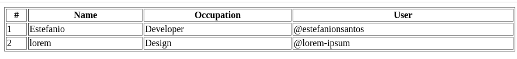
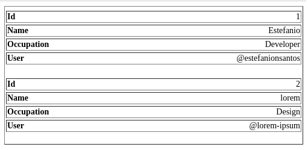

# Responsive table style

```HTML
<link rel="stylesheet" href="style.min.css" type="text/css" media="all" />
<table class="tb_fluid" width="100%" border="1">
    <thead>
        <tr>
            <th>#</th>
            <th>Name</th>
            <th>Occupation</th>
            <th>User</th>
         </tr>
     </thead>
     <tbody>
        <tr>
            <td colname="Id">1</td>
            <td colname="Name">Estefanio</td>
            <td colname="Occupation">Developer</td>
            <td colname="User">@estefanionsantos</td>
        </tr>
        <tr>
            <td colname="Id">2</td>
            <td colname="Name">lorem</td>
            <td colname="Occupation">Design</td>
            <td colname="User">@lorem-ipsum</td>
        </tr>
    </tbody>
</table>
```

#### Desktop


#### Mobile

